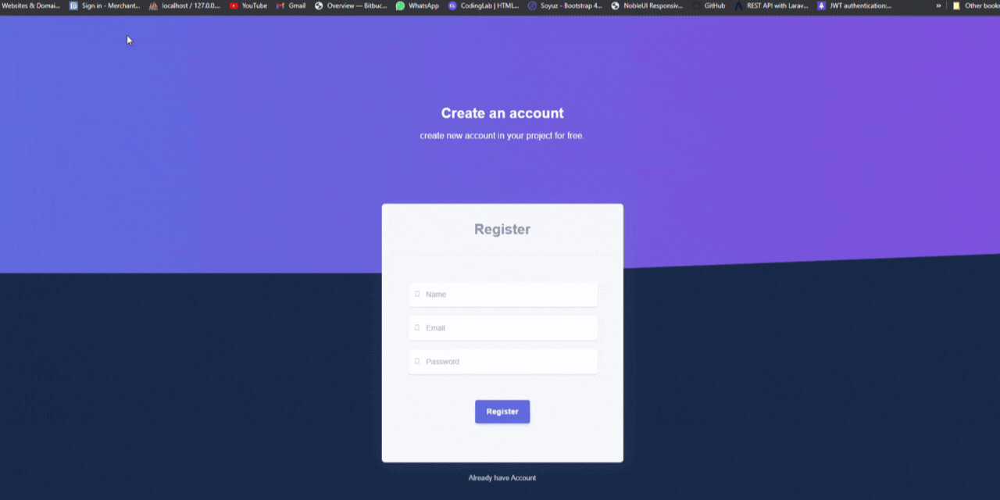
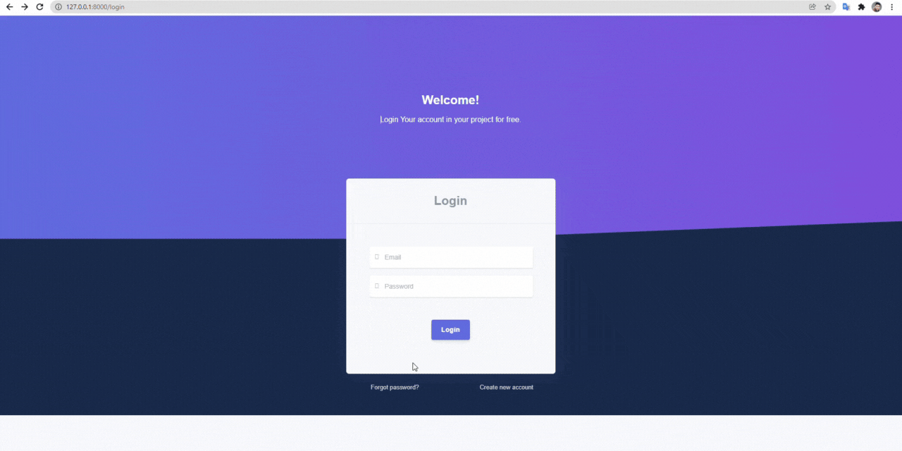

## laravel + Vue js dashboard
mini Project in Laravel and vue js. Laravel 8x + vue js Dashboard.Task management 
## How to use
1. git clone SSH `git clone git@github.com:HoanTV197/Task-Manager-System-.git`
2. Copy `.env.example file to .env`
3. Edit database credentials in .env file `DB_DATABASE=TaskManager`
4. Run `composer install`
5. Run `npm install`
6. Run `php artisan key:generate`
7. Run `php artisan migrate`
8. Run `npm run dev`
9. Run `php artisan ser` 
10. `http://localhost:8000/`

## Feature
Key Feature of Project.

- Project Management and Task Management System
- Responsive Template use in Vue js
- Front End Vue js
- Custom Authentication System (without jetstream)
- Email Send for Conformation Email
- verify email, reset password email (custom codding)
- Use email Google and Laravel feature
- Register,Login and forgot password without jetstream (custom codding)

`Note`: Please make sure Turn ON `Less secure app access` in your Google account without Email Not Send !.
- Please Following:- `Manage your Google Account => Security => Less secure app access =>Trun ON`

## Register View

## Email Verification View

## Forgot Password View

